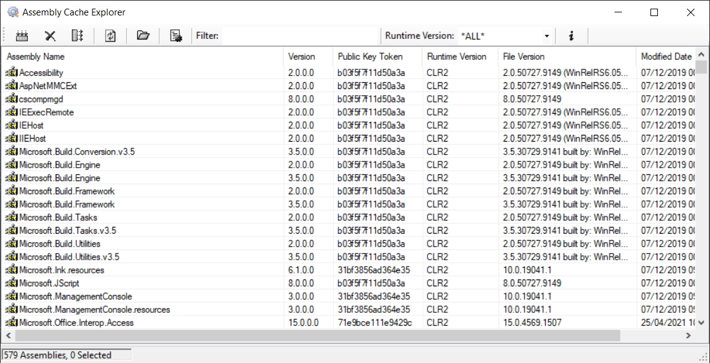

# Assembly Cache Explorer

## Description

Graphical interface for managing the CLR global assembly cache.

The following features are supported:

- Ability to view, filter, install and uninstall CLR assemblies.
- Ability to view assembly properties.
- Drag and drop assembly installation support.
- Keyboard shortcuts for refresh (F5) and uninstall assembly (Delete).
- Ability to export assemblies to a folder.
- Ability to backup asemblies during Install and Uninstall operations.

## Getting Started

- Open the solution `AssemblyCacheExplorer.sln` in Visual Studio.
- Ensure that the `AssemblyCacheExplorer` is set as the startup project.
- Run the application.

## License

Apache License 2.0
